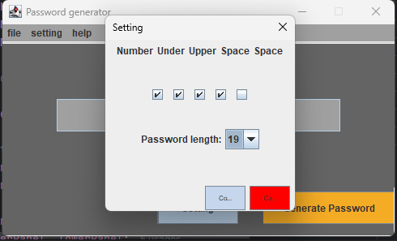
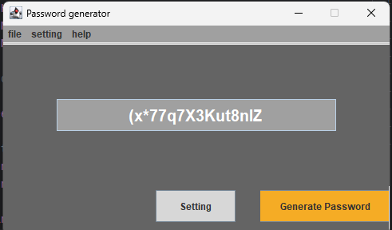

# PasswordGenerator
Generate your password with options!

## User setup

First, [download](https://github.com/MarcoBackman/PasswordGenerator/archive/refs/heads/main.zip) this repository.

Use batch file for Windows execution. Other operating system requires manual command execution.
- Simply execute `Run.bat` file with `Run As Administrator` if you want to install JDK17 .  
- Execute `Run.bat` file if JDK17 is already set
  Follow instructions from batch file. This batch will download and install jdk 17 and setup the environment variables if not set.

If you wish to set up by your own, please install jdk17+ and have it set as environment variable. Then run following command at the root of the downloaded file.
`java -jar PasswordGenerator.jar`